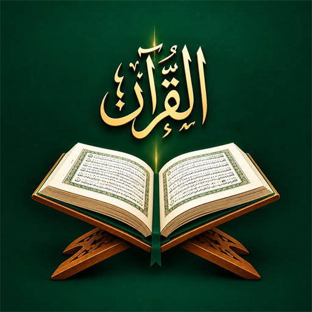

# Dalcanciaa | Official Website (`Dalcanciaa.com`)

<div align="center">
  
  <h1>Dalcanciaa</h1>
  <p><strong>Spiritual Clarity Meets Precision Engineering</strong></p>
  <p>The official parent website for the Dalcanciaa ecosystem of Islamic and lifestyle applications.</p>
</div>

---

## 🌟 Overview

**Dalcanciaa** develops purpose-built Islamic digital applications engineered with exquisite 3D craft, authentic heritage, and absolute privacy.

This repository hosts the official web hub for **[Dalcanciaa.com](https://dalcanciaa.com/)**, deployed directly via **GitHub Pages**.

---

## 📱 Ecosystem Applications

1. **Dalcanciaa 13-Line Quran** *(Live / Flagship — [View Dedicated Page](quran.html))*
   - Authentic 13-Line Indo-Pak script format with vector typography.
   - Tajweed color-coded edition.
   - 40+ authentic Quran Duas & Salawat collection with recitation counters.
   - Reading analytics, consistency calendar, streaks, and completed Qurans trophy tracking.
   - Integrated **Asma-ul-Husna (99 Names of Allah)** with meanings and audio.
   - Night mode, offline bookmarks, reading history, and **100% ad-free**.

2. **Dalcanciaa Habits** *(Coming Soon)*
   - Daily 5 Salah tracking with Sunnah, Tahajjud, and Duha logging.
   - Quran Juz and Ayah daily reading goal streaks.
   - Digital Tasbih & Adhkar counters.
   - 100% on-device privacy with zero external telemetry.

3. **Dalcanciaa Baby Names** *(In Research)*
   - Verified Arabic & Islamic names with scholarly origins and root meanings.
   - Quranic occurrences and prophetic connections.
   - Native audio pronunciation guides.

---

## 🗂️ Website Structure

- **`index.html`**: Parent brand landing page showcasing the Dalcanciaa studio, product catalog, core values, and community waitlist.
- **`quran.html`**: Dedicated flagship application page showcasing the 13-Line Quran app with 3D device mockups, feature-by-feature breakdowns, and full screenshot gallery.
- **`styles.css`**: Unified modern 3D design system with glassmorphism, responsive layouts, and animations.
- **`main.js`**: Interactive particle canvas, scroll reveals, 3D tilt effects, and gallery controls.
- **`CNAME`**: Configured for custom domain `dalcanciaa.com`.
- **`sitemap.xml` & `robots.txt`**: SEO configuration.

---

## 🛠️ Local Development

Open `index.html` or `quran.html` in any browser or run a local static server:

```bash
# Using Python
python -m http.server 8000

# Or using Node
npx serve .
```

---

© 2026 Dalcanciaa. Crafted with Ihsan.
